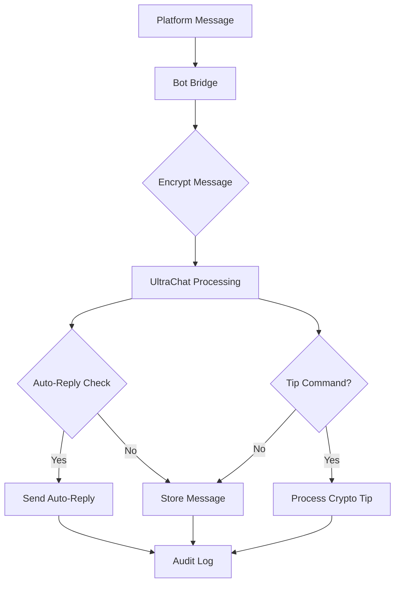

# UltraChat Bot Bridge - v1.2.3 Alpha

## 🤖 Secure Cross-Platform Messaging Bridge

The UltraChat Bot Bridge enables secure, encrypted messaging across Discord, Telegram, Twitter/X, and Signal while maintaining UltraChat's privacy-first principles.

## 🔐 **Security Features**

- **AES-256-GCM Encryption**: All messages encrypted end-to-end
- **Zero External Tracking**: No analytics or data transmission
- **Local Audit Trails**: Comprehensive logging for security
- **Trust-Based Permissions**: Web of Trust integration
- **Secure Key Management**: Local key storage only

## 🚀 **Quick Setup**

### 1. **Install Dependencies**
```bash
cd backend
npm install
```

### 2. **Run Setup Wizard**
```bash
node setup_bot_bridge.js
```
The wizard will:
- Generate secure encryption keys
- Configure bot platforms (Discord, Telegram, Twitter/X, Signal)
- Create `.env.local` with your settings
- Set up audit logging and directories

### 3. **Start Bot Bridge**
```bash
npm run bot-bridge
```

## 🤖 **Platform Configuration**

### **Discord Bot**
1. Create bot at [Discord Developer Portal](https://discord.com/developers/applications)
2. Get Bot Token from Bot section
3. Enable required intents: Message Content, Guild Messages
4. Add bot to your server with appropriate permissions

### **Telegram Bot**
1. Message [@BotFather](https://t.me/botfather) on Telegram
2. Create new bot with `/newbot`
3. Get bot token from BotFather
4. Optional: Set webhook URL for better performance

### **Twitter/X Bot**
1. Apply for API access at [developer.twitter.com](https://developer.twitter.com)
2. Create new app and generate keys
3. Enable OAuth 1.0a for DMs
4. Get API Key, Secret, Access Token, and Access Secret

### **Signal Bot** (Advanced)
1. Install [signal-cli](https://github.com/AsamK/signal-cli)
2. Register phone number with Signal
3. Configure path to signal-cli executable
4. Set up encryption key storage

## 💰 **Crypto Tipping Commands**

### **Discord**
```
!tip @user 0.001 BTC Thanks for the help!
!wallet BTC  # Show your BTC wallet
!balance     # Show tip balance
```

### **Telegram**
```
/tip @username 0.5 ETH Great work!
/wallet ETH  # Show your ETH wallet  
/balance     # Show tip balance
```

### **Supported Currencies**
- **BTC** (Bitcoin)
- **ETH** (Ethereum) 
- **DOGE** (Dogecoin)
- **LTC** (Litecoin)
- **SOL** (Solana)
- **PYTH** (Pyth Network)
- **LINK** (Chainlink)

## 🛡️ **Security Configuration**

### **Environment Variables**

**Required:**
```bash
ULTRACHAT_AES_KEY=your_32_byte_base64_key
```

**Bot Tokens:**
```bash
DISCORD_BOT_TOKEN=your_discord_token
TELEGRAM_BOT_TOKEN=your_telegram_token
TWITTER_API_KEY=your_twitter_key
# ... etc
```

**Security Settings:**
```bash
ULTRACHAT_TRUSTED_USERS_IDS=user1,user2,user3
ULTRACHAT_AUDIT_ENABLED=true
ULTRACHAT_AUDIT_ENCRYPTION=true
```

### **File Security**

**Protected Files (Never commit to Git):**
- `.env.local` - Bot configuration
- `bot_config.json` - Alternative config format
- `keys/` - Encryption keys
- `audit_logs/` - Security audit trails
- `userData/` - Local user data

## 📊 **Message Flow**



## 🔧 **Development**

### **Development Mode**
```bash
npm run bot-dev  # Auto-restart on changes
```

### **Testing Individual Platforms**
```bash
# Test Discord only
DISCORD_BOT_TOKEN=your_token node -e "
import Bridge from './bot_bridge.js';
const bridge = new Bridge();
bridge.connections.discord && console.log('Discord OK');
"
```

### **Debug Logging**
```bash
ULTRACHAT_LOG_LEVEL=debug npm run bot-bridge
```

## 📋 **Commands Reference**

### **Bot Management**
- `!status` - Bot bridge status
- `!platforms` - Available platforms  
- `!help` - Command help

### **Message Management**
- `!encrypt <message>` - Test encryption
- `!audit` - View recent audit logs (trusted users)
- `!trust @user` - Add to trusted users (moderators)

### **Crypto Tipping**
- `!tip @user amount currency [message]`
- `!wallet currency` - Show wallet address
- `!balance` - Show tip balance
- `!transactions` - Recent tip history

## ⚠️ **Security Warnings**

1. **Never commit `.env.local`** to version control
2. **Rotate bot tokens regularly**
3. **Monitor audit logs** for suspicious activity
4. **Use strong encryption keys** (32+ random bytes)
5. **Restrict bot permissions** to minimum required
6. **Keep dependencies updated**

## 🔍 **Troubleshooting**

### **Common Issues**

**Bot won't start:**
```bash
# Check configuration
cat .env.local | grep -E "TOKEN|KEY"
# Regenerate config
node setup_bot_bridge.js
```

**Encryption errors:**
```bash
# Verify key format (should be 44 chars base64)
echo $ULTRACHAT_AES_KEY | base64 -d | wc -c
# Should output: 32
```

**Platform connection failures:**
```bash
# Test individual platform
ULTRACHAT_LOG_LEVEL=debug npm run bot-bridge
```

### **Logs Location**
- Application logs: `./logs/ultrachat.log`
- Audit logs: `./audit_logs/`
- Error logs: Console output

## 🚦 **Status Monitoring**

The bot bridge provides health check endpoints:

```bash
curl http://localhost:3001/health
# Returns platform connection status
```

## 📞 **Support**

- **GitHub Issues**: [UltraChat Issues](https://github.com/KingULTRA1/UltraChat/issues)
- **Security Reports**: GitHub Security Advisories or [@Ultra1](https://X.com/Ultra1)
- **Documentation**: [UltraChat Wiki](https://github.com/KingULTRA1/UltraChat/wiki)

---

## 🎯 **Next Steps**

1. **Complete setup wizard**: `node setup_bot_bridge.js`
2. **Test each platform** individually
3. **Configure crypto tipping** wallets
4. **Set up trusted users** for moderation
5. **Monitor audit logs** for security

**Privacy First. Security Always. Ultra Seamless.** 🛡️⚡