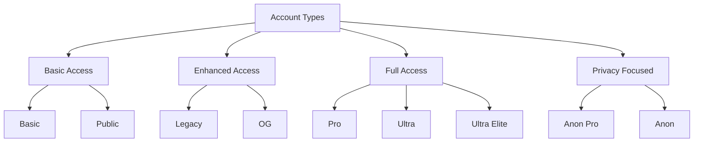
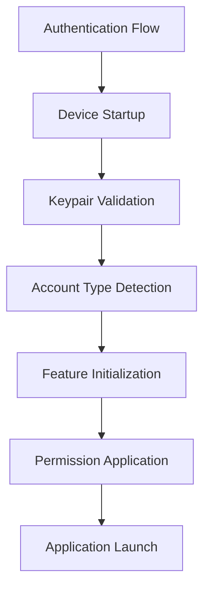
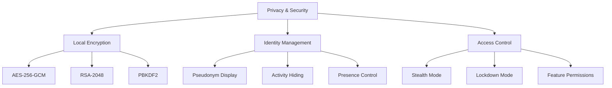
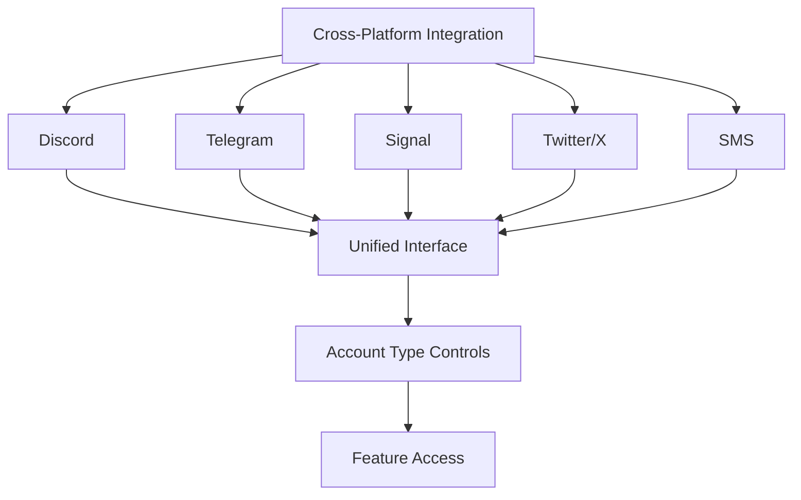
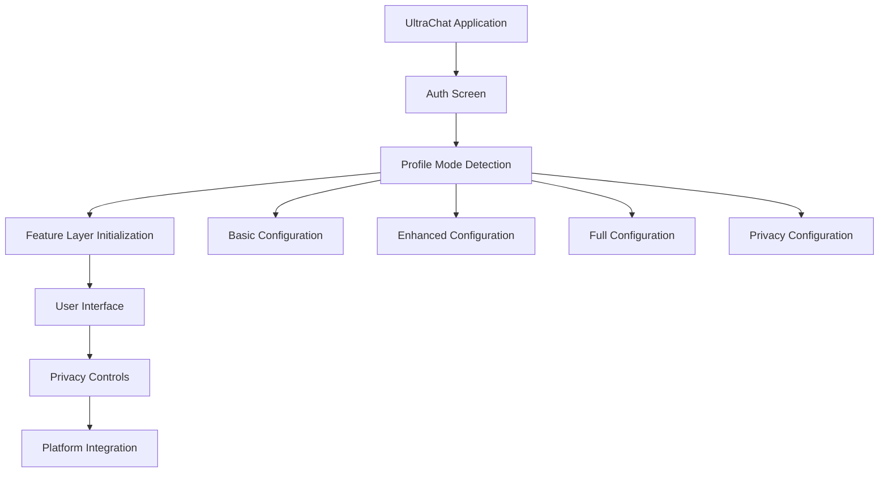

# UltraChat Account Types Architecture Map

## Visual Account Type Hierarchy

## Feature Access Matrix

```mermaid
graph LR
    F[Features] --> Chat[Chat]
    F --> Voice[Voice]
    F --> Events[Events/Calendar]
    F --> Stealth[Stealth/Lockdown]
    F --> CrossPlatform[Cross-Platform Sync]
    
    Chat --> B1A[✅]
    Chat --> B2A[✅]
    Chat --> C1A[✅]
    Chat --> C2A[✅]
    Chat --> D1A[✅]
    Chat --> D2A[✅]
    Chat --> D3A[✅]
    Chat --> E1A[✅]
    Chat --> E2A[✅]
    
    Voice --> B1B[❌]
    Voice --> B2B[❌]
    Voice --> C1B[✅]
    Voice --> C2B[✅]
    Voice --> D1B[✅]
    Voice --> D2B[✅]
    Voice --> D3B[✅]
    Voice --> E1B[✅]
    Voice --> E2B[❌]
    
    Events --> B1C[❌]
    Events --> B2C[❌]
    Events --> C1C[✅]
    Events --> C2C[✅]
    Events --> D1C[✅]
    Events --> D2C[✅]
    Events --> D3C[✅]
    Events --> E1C[✅]
    Events --> E2C[❌]
    
    Stealth --> B1D[❌]
    Stealth --> B2D[❌]
    Stealth --> C1D[❌]
    Stealth --> C2D[❌]
    Stealth --> D1D[✅]
    Stealth --> D2D[✅]
    Stealth --> D3D[✅]
    Stealth --> E1D[✅]
    Stealth --> E2D[✅]
    
    CrossPlatform --> B1E[❌]
    CrossPlatform --> B2E[❌]
    CrossPlatform --> C1E[✅]
    CrossPlatform --> C2E[✅]
    CrossPlatform --> D1E[✅]
    CrossPlatform --> D2E[✅]
    CrossPlatform --> D3E[✅]
    CrossPlatform --> E1E[✅]
    CrossPlatform --> E2E[✅]
```

## Authentication Flow

## Privacy & Security Layers

## Cross-Platform Integration

## Default Application Flow

